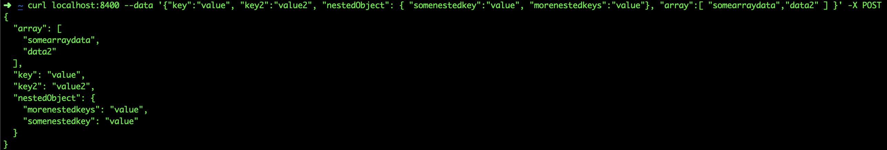
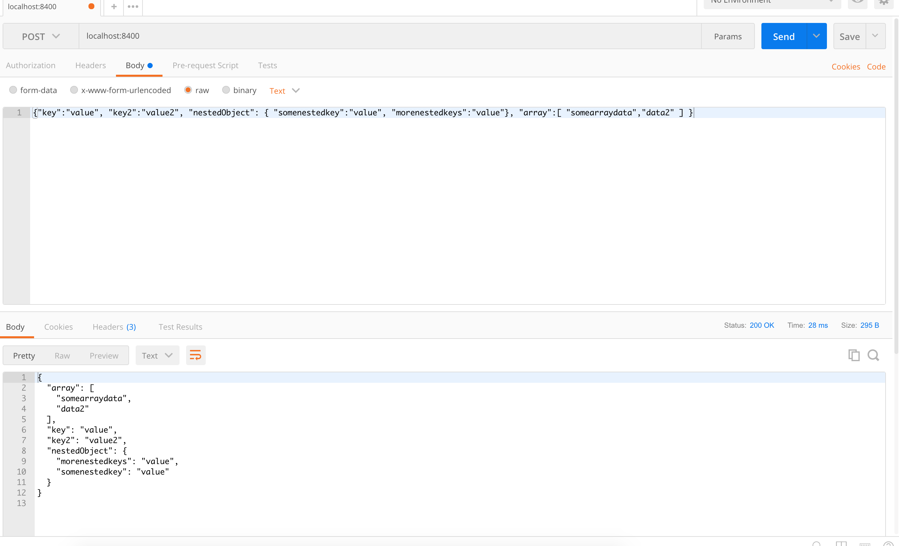

# JsonLinter
There are many tools to lint and format json.  This is a containerized api solution.  

This allows the running of postman/curl with an unformatted json blob, and the returned output will be formatted.

## Usage
To run in its default configuration run:

`make build-app image=YOURIMAGENAME port=EXTERNALPORT`

Replace `YOURIMAGENAME` with what you'd like to name the docker image, and port with the external port you'd like to hit the api on.  The application runs itself on port 8400.

There is also logging for simple reasons to see when and where requests come from and their methods.  These are output to stdout so the `docker logs` command works quite well with it.

## Building From Source

Its a very simple very small go package, so building it from source shouldn't be too difficult with a simple go build, or using the make directives:

`make build`

will build a binary named `linter`.  And from there move it anywhere in your `$PATH` and run it.
